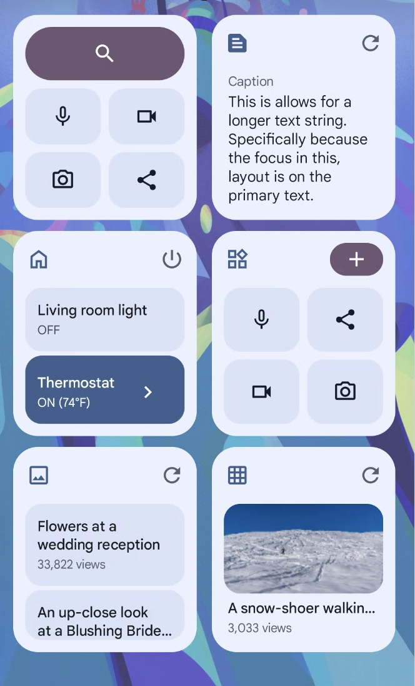

# AppWidgets samples

This module demonstrates how to build Android AppWidgets with:

* [`RemoteViews`](https://developer.android.com/reference/android/widget/RemoteViews)
  and the [new Widgets APIs](https://developer.android.com/about/versions/12/features/widgets)
  introduced in [Android 12](https://developer.android.com/studio/releases/platforms#12)
  (API level 31) together with
  [`core-remoteviews`](https://developer.android.com/jetpack/androidx/releases/core)
  .
* [Jetpack Glance](https://developer.android.com/jetpack/androidx/releases/glance) for app widgets.

The new set of APIs allows an application to build more engaging and beautiful widgets. Use this
sample together with the
[App widget guides](https://developer.android.com/guide/topics/appwidgets/overview).

# Pre-requisites

* Android 12 (API level 31)
* Android Studio Chipmunk or newer

# Getting Started

## Canonical Widget Layout Samples

These [layouts](./src/main/java/com/example/platform/ui/appwidgets/glance/layout) demonstrate how
to write responsive, high-quality layouts for use with your Glance widgets.

The `layouts` directory contains following layout categories:

* [collections](./src/main/java/com/example/platform/ui/appwidgets/glance/layout/collections)
  * [Action list](./src/main/java/com/example/platform/ui/appwidgets/glance/layout/collections/ActionListAppWidget.kt)
  * [Check list](./src/main/java/com/example/platform/ui/appwidgets/glance/layout/collections/CheckListAppWidget.kt)
  * [Image grid](./src/main/java/com/example/platform/ui/appwidgets/glance/layout/collections/ImageGridAppWidget.kt)
  * [Image text list](./src/main/java/com/example/platform/ui/appwidgets/glance/layout/collections/ImageTextListAppWidget.kt)

* [text](./src/main/java/com/example/platform/ui/appwidgets/glance/layout/text)
  * [Long Text](./src/main/java/com/example/platform/ui/appwidgets/glance/layout/text/LongTextAppWidget.kt)
  * [Text with image](./src/main/java/com/example/platform/ui/appwidgets/glance/layout/text/TextWithImageAppWidget.kt)

* [toolbars](./src/main/java/com/example/platform/ui/appwidgets/glance/layout/toolbars)
  * [Toolbar with app name](./src/main/java/com/example/platform/ui/appwidgets/glance/layout/toolbars/ToolBarAppWidget.kt)
  * [Toolbar with search bar](./src/main/java/com/example/platform/ui/appwidgets/glance/layout/toolbars/SearchToolBarAppWidget.kt)
  * [Toolbar with expressive shape](./src/main/java/com/example/platform/ui/appwidgets/glance/layout/toolbars/ExpressiveToolbarAppWidget.kt)

Each of these layout categories contains a `layout` sub-directory that can be copied to your project
to reuse the layouts in your code.

The `{layoutType}Layout` file e.g. `ToolBarLayout` contains:
* A top level composable e.g. `ToolBarLayout`, 
* Sub components,
* A breakpoints definition e.g. `ToolBarLayoutSize`,
* Constants / dimensions e.g. `ToolBarLayoutDimens`,
* Followed by Android Studio Preview for the layout.

Read more about the layouts: https://developer.android.com/design/ui/mobile/guides/widgets/layouts



> More showcasing resources in the [screenshots folder](screenshots)

## Widget Pinning

In addition, the [AppWidgets.kt](src/main/java/com/example/platform/ui/appwidgets/AppWidgets.kt)
showcases how to request the launcher to "pin" an appwidget.

## Run a new configuration

When creating a new run configuration, it's important to ensure that the widget is recreated without
launching a new activity. Follow these steps to do so:

1. In Android Studio, select **Run > Edit Configurations**.
2. In the **Run/Debug Configurations** dialog, select **Always install with package manager...**.
3. Under **Launch Options**, in the **Launch** menu, select **Nothing**.

This will ensure that the widget is recreated but no activity is launched.


# Support

- Stack Overflow: https://stackoverflow.com/questions/tagged/glance-appwidget
- Channel #glance at KotlinLang
  Slack [(request to join)](https://surveys.jetbrains.com/s3/kotlin-slack-sign-up).

If you've found an error in this sample, please file an issue at https://github.com/android/user-interface.

For API-related issues, please file any bugs using the following links:

- For Glance: https://issuetracker.google.com/issues/new?component=1097239&template=1611667
- For Core Remote Views: https://issuetracker.google.com/issues/new?component=460834&template=1418393

## License

```
Copyright 2023 The Android Open Source Project
 
Licensed under the Apache License, Version 2.0 (the "License");
you may not use this file except in compliance with the License.
You may obtain a copy of the License at

    https://www.apache.org/licenses/LICENSE-2.0

Unless required by applicable law or agreed to in writing, software
distributed under the License is distributed on an "AS IS" BASIS,
WITHOUT WARRANTIES OR CONDITIONS OF ANY KIND, either express or implied.
See the License for the specific language governing permissions and
limitations under the License.
```