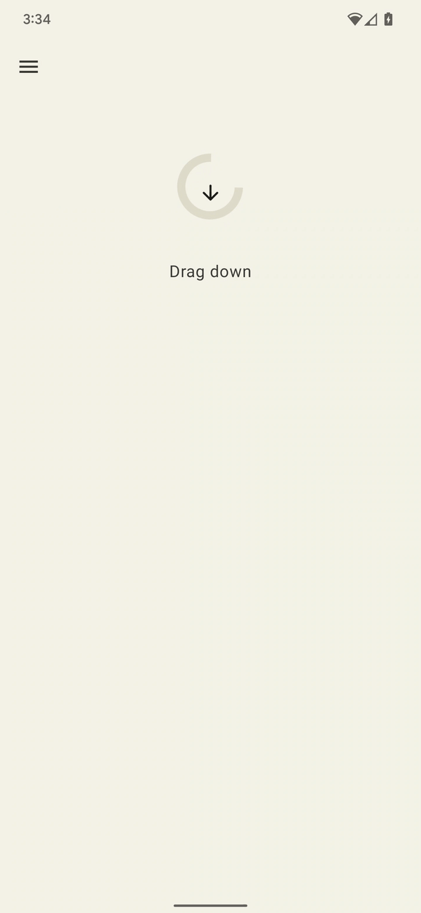
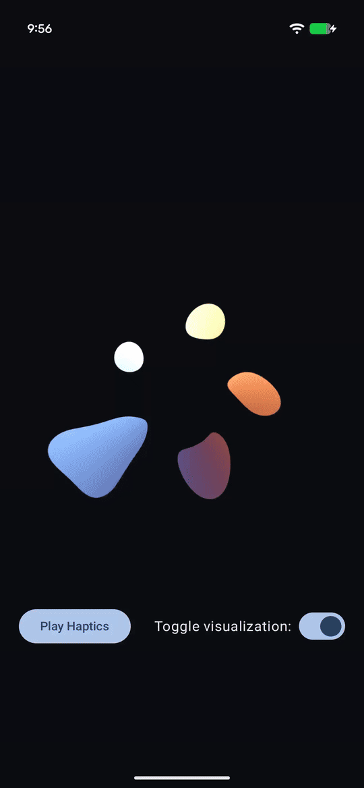

Haptic Samples
==============

Android provides wide access to the device vibrator hardware so you can play different
vibration effects and patterns from your app. 

Haptics can enrich your app experience by attracting
the user's attention when it’s required, providing useful feedback to their interactions, and
augmenting audio-visual content with tactile sensations.

> Important Note: Many of the primitives used in this sample are not yet widely available
on Android phones.The app will notify you if the device you are using does not
support the example as intended. 

## Vibration effects

This sample contains examples of various vibration effects you can use within your app. In the cases
where we know the example will not play on your specific device, we disable the button. On some
devices, however, it is possible that the button will remain enabled but there is no effect.

There are 4 examples of "rich haptics" built upon a few of the latest primitives available in the
Android framework.

## Resist

Controlling the amplitude of the primitive vibration can be used to convey 
useful feedback to an action in progress. Closely-spaced scale values can be
used to create a smooth crescendo effect of a primitive.
The delay between consecutive primitives can also be dynamically set based on
the user interaction. 

In this example as the user pulls down we simulate
resistance by increasing the intensity and reducing the duration between
vibration effects.



## Expand

There are two primitives for ramping up the perceived vibration intensity: 
the PRIMITIVE_QUICK_RISE and PRIMITIVE_SLOW_RISE. 
They both reach the same target, but with different durations. There is only one 
primitive for ramping down, the PRIMITIVE_QUICK_FALL. These primitives work 
better together to create a waveform segment that grows in intensity and 
then dies off. You can align scaled primitives to prevent sudden jumps in
amplitude between them, which also works well for extending the overall effect 
duration. Perceptually, people always notice the rising portion more than the
falling portion, so making the rising portion shorter than the falling can
be used to shift the emphasis towards the falling portion.

This example uses an expanding and collapsing circle with haptics to enhance
the feeling of expansion and collapsing with an added tick to sharpen that the
animation has ended.


## Bounce

This example showcases the PRIMITIVE_THUD as an example of using vibration
effects to simulate physical interactions. In the example the ball drops with
multiple bounces, playing the primitive at a decreased intensity each time.


### Wobble

This example show cases how you can use the PRIMITIVE_SPIN to delight users
with a wobbling effect. The elastic shape bounces back after being dragged
down, applying a pair of spin effects with varying intensities proportional to
how far you drag down.

As alluded to above, this primitive is most effective when it is
called more than once. Multiple spins concatenated can create a wobbling
and unstable effect, which can be further enhanced by applying a somewhat 
random scaling on each primitive. You can also experiment with the gap between 
successive spin primitives. Two spins without any gap (0 ms in between) creates
a tight spinning sensation while increasing the inter-spin gap from 10 to 50 ms leads
to a looser spinning sensation.


### LavaBeats

The `WaveformEnvelopeBuilder` is a powerful API to create complex haptics by
enabling the control of amplitude and frequency segments in a vibration. This
example demonstrates how to use this API to create a haptic sensation of
"liveliness".

In the example, two biomarkers of a typical electrocardiogram (ECG) signal are
represented with vibration pulses of varying amplitudes and frequencies. The
first pulse represents the QRS complex of the ECG, which shows as a sharp peak
of high amplitude and short duration. The second pulse is the T wave, which has
lower amplitude, longer duration, and a smoother shape.

The `WaveformEnvelopeBuilder` is used to construct various repetitions of these
two pulses separated by a fixed first-to-second pulse delay. The first pulse is
a chirp signal that starts at a low frequency and ends at a higher frequency
over a short duration. The second pulse is a single period of a low frequency
sinusoid. The two pulses are composed into a beat, and repeated several times
with delay in-between following a typical beats-per-minute (bpm) rate. The
result is a haptic effect that resembles a beating heart.

LavaBeats also allows users to configure all the parameters of the effect to
emulate various beating patterns. It also displays a lava-lamp visualization
that beats at the same rhythm as the haptic pattern.



## License

```
Copyright 2023 The Android Open Source Project
 
Licensed under the Apache License, Version 2.0 (the "License");
you may not use this file except in compliance with the License.
You may obtain a copy of the License at

    https://www.apache.org/licenses/LICENSE-2.0

Unless required by applicable law or agreed to in writing, software
distributed under the License is distributed on an "AS IS" BASIS,
WITHOUT WARRANTIES OR CONDITIONS OF ANY KIND, either express or implied.
See the License for the specific language governing permissions and
limitations under the License.
```
